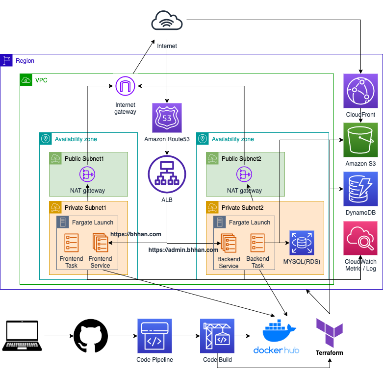
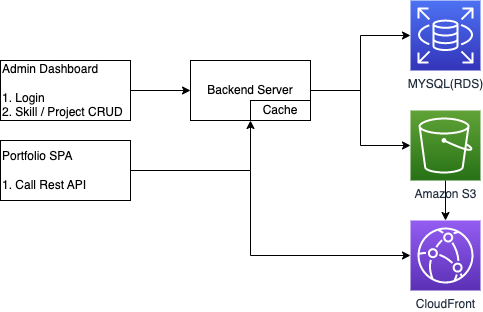

## bhhan-server-migration
> 포트폴리오 백엔드 서버

### 서버 아키텍처

- CI/CD (github -> Code Pipeline -> Code Build)
  - Unit Test -> Integration Test -> Docker Image Build And Push -> Terraform Deploy
- JPA ORM (Server Domain)
- Spring Security / Thymeleaf (Dashboard Service)
- ECS Fargate (Container Orchestration)
- Cloud Resource(AWS S3, CloudFront, RDB(Mysql), Route53, ALB)

### 서버 동작

- 로컬 환경(docker / docker-compose installed)
  - 실행: ./gradlew buildAndStartServices(ID: user@email.com / PW: 1234)
  - 종료: ./gradlew stopServices

### 어플리케이션 URL
- portfolio - https://app.bhhan.com
- dashboard - https://admin.bhhan.com

### 프론트엔드 Github
- https://github.com/bhhan5274/bhhan-portfolio
